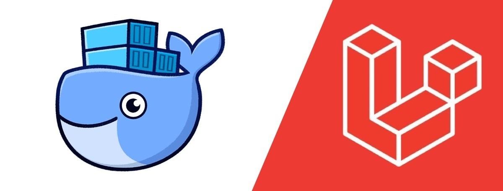

# Laravel with Docker 🐳

<p align="center">
    
</p>

## Introduction

Build a simple laravel application development environment with docker-compose.


## Requirement
- Docker ^19.*

## Available containers
- ``app`` used image:
  - [php](https://hub.docker.com/_/php):8.1-fpm
  - [composer](https://hub.docker.com/_/composer):2.3
  - [npm](https://deb.nodesource.com/setup_lts.x):latest
- ``web`` used image: [nginx](https://hub.docker.com/_/nginx):stable-alpine
- ``db`` used image: [mysql](https://hub.docker.com/_/mysql):8.0
- ``phpmyadmin`` used image: [phpmyadmin](https://hub.docker.com/_/phpmyadmin):latest
- ``redis`` used image: [redis](https://hub.docker.com/_/redis):latest *(Optional)*
- ``rabbitmq`` used image: [rabbitmq](https://hub.docker.com/_/rabbitmq):latest *(Optional)*

## How to use it?

1. click [Use this template](https://github.com/agungprsty/laravel-with-docker/generate)
2. git clone & change directory
3. execute the following command

```bash
$ make create-project # Install the latest Laravel project
```
4. set src/.env variable :
```
DB_CONNECTION=mysql
DB_HOST=mysql
DB_PORT=3306
DB_DATABASE=laravel
DB_USERNAME=admin
DB_PASSWORD=admin
```
5. Try to access the services in your browser
   - Laravel app (http://localhost:8110)
   - phpMyAdmin (http://localhost:8101)

#### Thanks and Inspired by: [@ucan-lab](https://github.com/ucan-lab)
